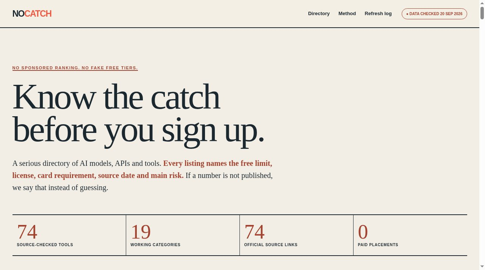

# NoCatch

Know the catch before you sign up. A serious directory of AI models, APIs and tools.



**Live:** https://aeiouvcode.github.io/nocatch/

## About

Every listing names the free limit, license, card requirement, source date and main risk. If a number is not published, the entry says so instead of guessing.

- **Official page first.** Limits and terms come from the vendor's own pricing, product or license page, not from aggregators.
- **Open means something.** Open source, open weights and closed service are labelled separately.
- **Stale is visible.** Every quota carries a checked date.
- **No paid placements.** No sponsored ranking.

Search, filters and saved tools run only in the browser. No analytics, accounts or trackers, and a strict Content Security Policy blocks outbound requests.

## Run locally

```sh
git clone https://github.com/aeiouvcode/nocatch.git
cd nocatch
python3 -m http.server 8000
```

Then open http://localhost:8000.
